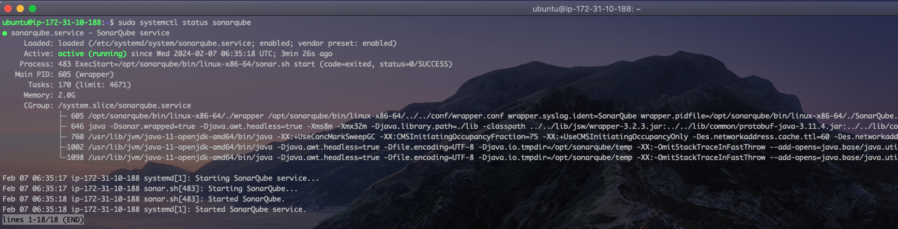
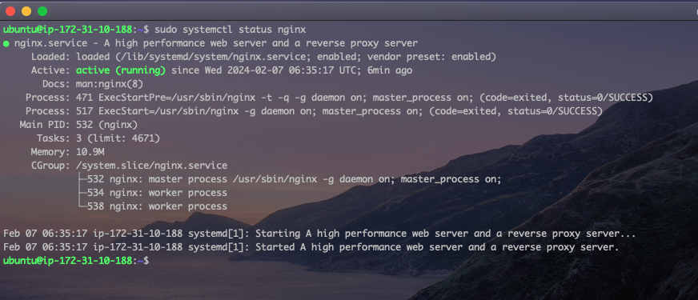
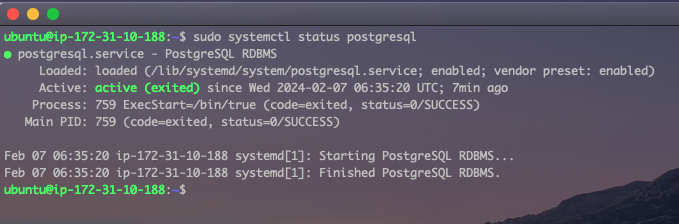
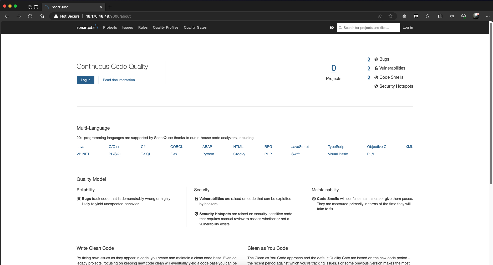

# Installing and Configuring SonarQube on Ubuntu 20

SonarQube is a widely-used open-source platform for continuous inspection of code quality and security. It provides developers and teams with a comprehensive set of tools to detect bugs, vulnerabilities, code smells, and other quality issues in their source code. By integrating directly into the development workflow, SonarQube offers real-time feedback on code quality, enabling teams to identify and address issues early in the development process.

In this project, we will be installing and configuring SonarQube alone, and in a different project, we will integrate SonarQube with other softwares such as Jenkins to check the overall codebase of a software for quality issues.

Let's begin...

SonarQube installation is not as straightfoward as other software packages such as Tomcat,Java etc. To simplify this task, we will be using a `bash script` developed by
[Visualpath](https://www.youtube.com/c/visualpath). The script has already been perfectly written to take care of everything underhood. However, it is essential we understand what exact its happening under the hood and that's what we will be exploring in this project.

A copy of full `bash script` can be found here, but first, let's breakdown the script to understand the steps involved in installing and confirguring SonarQube.

> ```bash
> cp /etc/sysctl.conf /root/sysctl.conf_backup
> cat <<EOT> /etc/sysctl.conf
> vm.max_map_count=262144
> fs.file-max=65536
> ulimit -n 65536
> ulimit -u 4096
> EOT
> cp /etc/security/limits.conf /root/sec_limit.conf_backup
> cat <<EOT> /etc/security/limits.conf
> sonarqube   -   nofile   65536
> sonarqube   -   nproc    409
> EOT
> ```

- `cp /etc/sysctl.conf /root/sysctl.conf_backup`: This line creates a backup of the sysctl.conf before we make any changes to the file.
- `cat <<EOT> /etc/sysctl.conf`: This line uses a Bash here document (<<EOT) to write multiple lines of text directly into the file /etc/sysctl.conf. The content written between the <<EOT and EOT markers will be appended to the file.
- `vm.max_map_count=262144`: Now, we've started making changes to the `sysctl.conf` file. This command sets the value of vm.max_map_count kernel parameter to 262144. This parameter controls the maximum number of memory map areas a process may have.
- `fs.file-max=65536`: This sets the value of fs.file-max kernel parameter to 65536. This parameter controls the maximum number of file handles that the Linux kernel will allocate.
- `ulimit -n 65536`: This sets the maximum number of open file descriptors (-n) for the current shell session to 65536. This change is applied for the current session only.
- `ulimit -u 4096`: This sets the maximum number of user processes (-u) for the current shell session to 4096. This change is also applied for the current session only. And the next line `EOT` informs the syetem that we are done editing the `sysctl.conf` file.
- `cp /etc/security/limits.conf /root/sec_limit.conf_backup`: As with the `sysctl.conf`, here, we are creating a backup of the `limits.conf` file.
- `sonarqube - nofile 65536`: This adds a configuration entry to `limits.conf `specifying that the user sonarqube should have a maximum number of open files (nofile) set to 65536.
- `sonarqube - nproc 409`: This adds another configuration entry to `limits.conf`, specifying that the user sonarqube should have a maximum number of processes (nproc) set to 409.

> ```bash
> sudo apt-get update -y
> sudo apt-get install openjdk-11-jdk -y
> sudo update-alternatives --config java
> ```

The set of commands above are to update the package information, install OpenJDK, a major requirement for SonarQube, and the configure the java runtime to allow selecting OpenJDK as the default if mutiple java runtime environments exits.

> ```bash
> sudo apt update
> wget -q https://www.postgresql.org/media/keys/ACCC4CF8.asc -O - | sudo apt-key add -
>
> sudo sh -c 'echo "deb http://apt.postgresql.org/pub/repos/apt/ `lsb_release -cs`-pgdg main" >> /etc/apt/sources.list.d/pgdg.list'
> sudo apt install postgresql postgresql-contrib -y
> sudo systemctl enable postgresql.service
> sudo systemctl start  postgresql.service
> sudo echo "postgres:admin123" | chpasswd
> runuser -l postgres -c "createuser sonar"
> sudo -i -u postgres psql -c "ALTER USER sonar WITH ENCRYPTED PASSWORD 'admin123';"
> sudo -i -u postgres psql -c "CREATE DATABASE sonarqube OWNER sonar;"
> sudo -i -u postgres psql -c "GRANT ALL PRIVILEGES ON DATABASE sonarqube to sonar;"
> systemctl restart  postgresql
>
> ```

The code above installs and configures PostgreSQL. After installation, a new database user was created called `sonar`, and a new was also created called `sonarqube`. The user was also granted all the necessary permissions on the newly created database.

> ```bash
> sudo mkdir -p /sonarqube/
> cd /sonarqube/
> sudo curl -O https://binaries.sonarsource.com/Distribution/sonarqube/sonarqube-8.3.0.34182.zip
> sudo apt-get install zip -y
> sudo unzip -o sonarqube-8.3.0.34182.zip -d /opt/
> sudo mv /opt/sonarqube-8.3.0.34182/ /opt/sonarqube
> sudo groupadd sonar
> sudo useradd -c "SonarQube - User" -d /opt/sonarqube/ -g sonar sonar
> sudo chown sonar:sonar /opt/sonarqube/ -R
> cp /opt/sonarqube/conf/sonar.properties /root/sonar.properties_backup
> cat <<EOT> /opt/sonarqube/conf/sonar.properties
> sonar.jdbc.username=sonar
> sonar.jdbc.password=admin123
> sonar.jdbc.url=jdbc:postgresql://localhost/sonarqube
> sonar.web.host=0.0.0.0
> sonar.web.port=9000
> sonar.web.javaAdditionalOpts=-server
> sonar.search.javaOpts=-Xmx512m -Xms512m -XX:+HeapDumpOnOutOfMemoryError
> sonar.log.level=INFO
> sonar.path.logs=logs
> EOT
>
> ```

With the commands above, we downloaded, installed, and configured SonarQube. It also created a dedicated user and group for running SonarQube, and ensures proper ownership and permissions for the SonarQube installation directory. The code also configured the SonarQube properties file `sonar.properties` with the necessary settings to connect to the PostgreSQL database we created earlier.

> ```bash
> cat <<EOT> /etc/systemd/system/sonarqube.service
> [Unit]
> Description=SonarQube service
> After=syslog.target network.target
>
> [Service]
> Type=forking
>
> ExecStart=/opt/sonarqube/bin/linux-x86-64/sonar.sh start
> ExecStop=/opt/sonarqube/bin/linux-x86-64/sonar.sh stop
>
> User=sonar
> Group=sonar
> Restart=always
>
> LimitNOFILE=65536
> LimitNPROC=4096
>
>
> [Install]
> WantedBy=multi-user.target
> EOT
>
> systemctl daemon-reload
> systemctl enable sonarqube.service
>
> ```

The commands above are used to create a systemd service unit file for managing the SonarQube service and then enable it for automatic startup.

> ```bash
> apt-get install nginx -y
> rm -rf /etc/nginx/sites-enabled/default
> rm -rf /etc/nginx/sites-available/default
> cat <<EOT> /etc/nginx/sites-available/sonarqube
> server{
>    listen      80;
>    server_name sonarqube.groophy.in;
>
>    access_log  /var/log/nginx/sonar.access.log;
>    error_log   /var/log/nginx/sonar.error.log;
>
>    proxy_buffers 16 64k;
>    proxy_buffer_size 128k;
>
>    location / {
>        proxy_pass  http://127.0.0.1:9000;
>        proxy_next_upstream error timeout invalid_header http_500 http_502 http_503 http_504;
>        proxy_redirect off;
>
>        proxy_set_header    Host            \$host;
>        proxy_set_header    X-Real-IP       \$remote_addr;
>        proxy_set_header    X-Forwarded-For \$proxy_add_x_forwarded_for;
>        proxy_set_header    X-Forwarded-Proto http;
>    }
> }
> EOT
> ln -s /etc/nginx/sites-available/sonarqube /etc/nginx/sites-enabled/sonarqube
> systemctl enable nginx.service
> #systemctl restart nginx.service
> sudo ufw allow 80,9000,9001/tcp
>
> echo "System reboot in 30 sec"
> sleep 30
> reboot
>
> ```

The code above installs and configures NGINX as a reverse proxy for SonarQube, enabling it to forward HTTP requests to the SonarQube application running on port 9000. The code also sets the firewall rules to enable Sonarqube function properly. Finally, the system is rebooted so all the changes we've made so far can take effect.

In summary, the script confirgured some kernel properties in the `sysctl.conf` file, installed Java, a major requirement of sonarqube, installed PostgreSQL and then created a database as well as a database user to store reports from sonarqube. After all that has been done, Sonarqube was installed and configured to connet with the database earlier created. Finally, the script installed NGINX and configured it to server as a reverse proxy for the sonarqube application runniing on port `9000`.

Now, let's run the actual script. It's recommended to install Sonarqube on a system with at least 2 processors and 4GBram,

- From the linux terminal, switch to a root user and ensure the script has been confirgured to be executable.
- Run the script by executing the command `./sonar_setup.sh`. This should take sometime and the system should reboot automatically.
- After the system reboots, confirm sonarqube has been installed sucessfully by running the command `sudo systemctl status sonarqube`.
  
- Let's also confirm NGINX is installed and running using the command `sudo systemctl status nginx`
  
- We do the same for PostgreSQL.
  
- And finally, let's log into the SonarQube Server. Remember, we confirgured sonarqube to run on port `9000`, ensure your security group or firewalls are confirgured to allow traffic from that port.

From a web browser, type in [YOUR-PUBLIC-IP-ADDRESS:9000] or [localhost:9000] if installed on your local computer.


And there you have it.

    The username and password is `admin`. Ensure this is changed upon log in.
